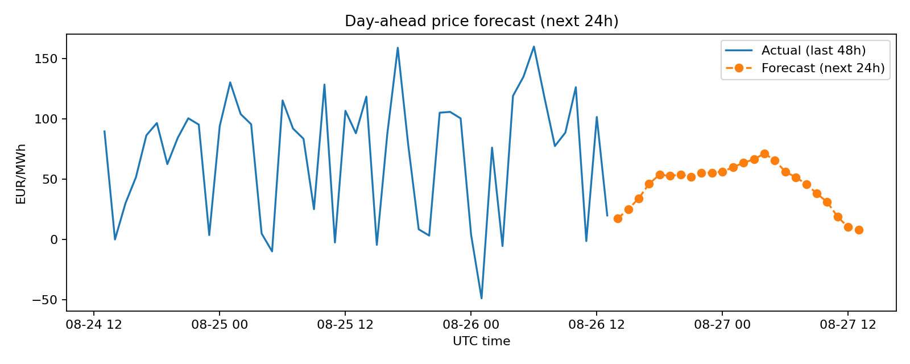

# ⚡ German Energy Market Price Forecasting

[]()
[]()
[]()
[]()

Forecasting **day-ahead electricity prices** in Germany with the impact of renewables (wind & solar).  
The project combines **data ingestion (OPSD, ENTSO-E, SMARD)**, **feature engineering**, **machine learning (XGBoost, quantile regression)**,  
and **automation with Airflow**, exposing both a **FastAPI service** and a **Streamlit dashboard**.

---

## 📌 Features

- 🔄 **Data ingestion** from OPSD, ENTSO-E, and SMARD APIs  
- 🛠️ **Feature engineering** with lagged values, rolling means, and calendar effects  
- 📈 **Baseline & Quantile models** (XGBoost) for point + probabilistic forecasts  
- 🔍 **Model explainability** via SHAP feature importances  
- 📊 **Visualization**: prediction plots, fan charts, calibration curves  
- ⚙️ **Automation**: Airflow DAGs for daily data fetch, feature building, training, validation  
- 🚀 **APIs & Dashboard**: FastAPI for predictions + Streamlit dashboard for exploration  

---

## 🏗️ Architecture


---

## 🚀 Quickstart

```bash
# 1. Clone repo
git clone https://github.com/<your-username>/german-energy-forecasting.git
cd german-energy-forecasting/app

# 2. Copy env file and add secrets
cp .env.example .env
# Edit .env to add ENTSOE_TOKEN and DB settings

# 3. Start services
docker compose up -d

# 4. Run migrations
make migrate

# 5. Build features
make build-features

# 6. Train baseline model
make train-baseline

# 7. Predict next 24h
make forecast
```

---

## 📊 Example Results

| Metric | Value |
|--------|-------|
| MAE    | ~3.17 €/MWh |
| RMSE   | ~5.11 €/MWh |

## 📊 Results & Visuals

Here are some example outputs from the project:

| 24h Forecast | Probabilistic Fan Chart |
|--------------|--------------------------|
|  |  |

| Feature Importance | SHAP Beeswarm |
|--------------------|----------------|
|  |  |


### Airflow DAG (ETL & Forecasting Pipeline)


### FastAPI Endpoint (Serving Forecasts)


### Streamlit Dashboard (Visualization & Explainability)


---

## 📅 Automation with Airflow

Airflow orchestrates the pipeline:

- **Fetch data** from OPSD, ENTSO-E, SMARD  
- **Build features** and load into Postgres  
- **Train models** and validate metrics  
- **Run data quality checks**  

Access UI: [http://localhost:8080](http://localhost:8080)  

---

## 📦 Tech Stack

- **Python** (pandas, scikit-learn, xgboost, shap)  
- **Docker** (multi-service setup)  
- **Postgres** for feature store  
- **Airflow** for orchestration  
- **FastAPI** (REST API for predictions)  
- **Streamlit** (interactive dashboard)  

---

## 🔑 Environment Variables

Create a `.env` file with:

```ini
POSTGRES_USER=epfd
POSTGRES_PASSWORD=epfd
POSTGRES_DB=epfd
POSTGRES_HOST=postgres

ENTSOE_TOKEN=your_api_key_here
```

---

## 📌 To Do / Future Work

- [ ] CRPS scoring for probabilistic forecasts  
- [ ] CI/CD pipeline (GitHub Actions)  
- [ ] Model registry integration (MLflow or similar)  
- [ ] Deploy dashboard online  

---

## 📜 License

MIT License © 2025 Firas Sakli


